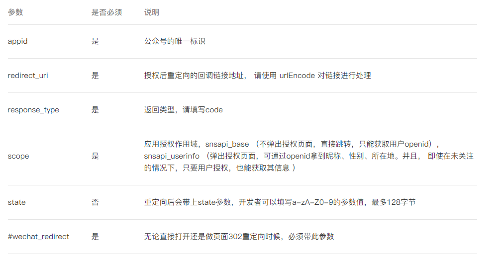
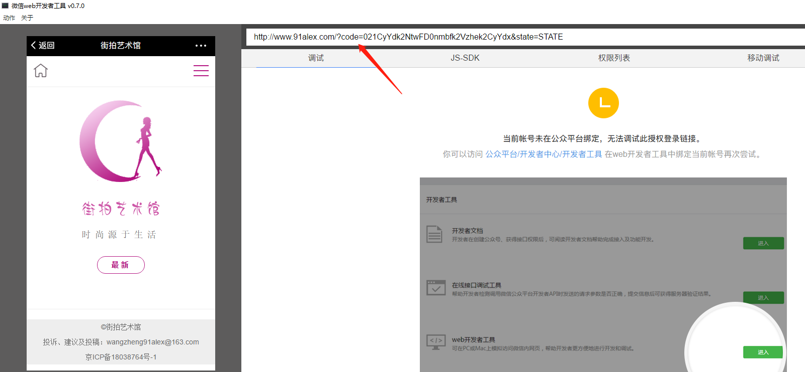
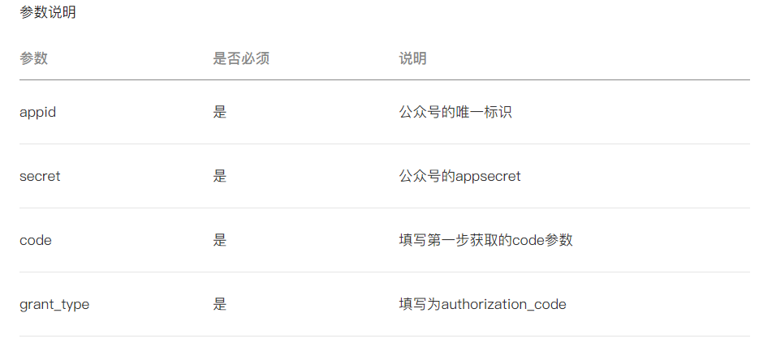

# 获取code

在微信开发者工具中输入：

```js
https://open.weixin.qq.com/connect/oauth2/authorize?appid=wx470416dc40550534&redirect_uri=http%3A%2F%2Fwww.91alex.com%2Fpay&response_type=code&scope=snsapi_base&state=STATE#wechat_redirect
```

其中各参数说明如下：



用户同意授权后，页面将跳转至: redirect_uri/?code=CODE&state=STATE




# 通过code换取网页授权access_token和 openid

获取code后，请求以下链接获取access_token：  

```text
https://api.weixin.qq.com/sns/oauth2/access_token?appid=wx470416dc40550534&secret=4c7484901171665ffdc6f37fa4bef7f7&code=071v0oN90jLjTy1mJcR90kHkN90v0oN6&grant_type=authorization_code
```



微信服务器返回的数据如下：

```json
{
    "access_token":"28_70M6Jjzt0WB8-TkHF-gtrpPpn9NBWuqq4ZSDRoUl26NDagsHjMajt84OFJKbKJUhUIvXV70OQVVqtmPEnxTVbg",
 
 "expires_in":7200,
 "refresh_token":"28_R3DNmJhva3w-L5g4boS8Flafnn3DQTvks1MZaN3wwDa4Lb_nXw-x2kwRmUB_wH4tocaJFvJpyzj4Sm1O-_rfZg",
 "openid":"oVYYEwXZqm9XBNxzuIOFQGKlJEEw","scope":"snsapi_base"
}
```


注意：由于公众号的secret和获取到的access_token安全级别都非常高，必须只保存在服务器，

