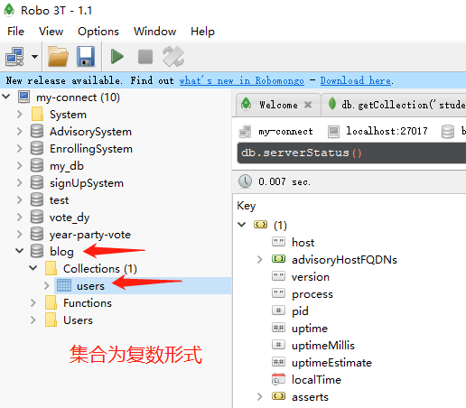

# mongoose

## 1、启动mongodb

> mongod  --config  "C:\Program Files\MongoDB\Server\3.2\mongodb.cfg"

## 2、打开Robo3T

## 3、新建数据库，集合



## 4、编辑集合

将如下集合插入到

```json
{ 
    "_id": { "$oid": "58c284b13a1bb9aa7033801b" }, 
    "name": "zhangsan",
    "password": "123",
    "email": '1'
}
{ 
    "_id": { "$oid": "58c284d7117a2e6599abef5e" },
    "name": "lisi",
    "password": "456", 
    "email": '2' 
}
```


## 5、安装 moongose

> npm install mongoose --save


## 6、启动mongoose

将一下代码 添加到app.js中, 然后 npm start 启动 服务器

```javascript
const mongoose = require("mongoose");

// mongoose以非授权的方式启动
mongoose.connect("mongodb://127.0.0.1:27017/blog", {
    useNewUrlParser: true,
    useUnifiedTopology: true
});

/*链接成功*/
mongoose.connection.on("connected", function() {
        console.log("mongodb connected success");
    })
    /* 链接失败*/
mongoose.connection.on("error", function() {
        console.log("mongodb connected fail");
    })
    /* 断开链接*/
mongoose.connection.on("disconnected", function() {
    console.log("mongodb connected disconnected");
})
```


启动成功后控制台输出

```
PS D:\H5\Node\blog\server> npm start

> server@0.0.0 start D:\H5\Node\blog\server
> node ./bin/www

mongodb connected success
```

